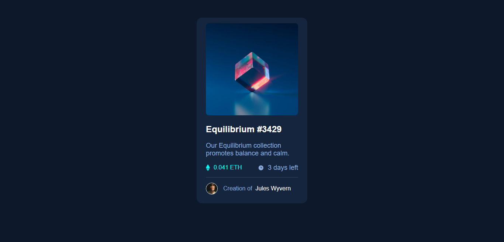

# Frontend Mentor - NFT preview card component solution

This is a solution to the [NFT preview card component challenge on Frontend Mentor](https://www.frontendmentor.io/challenges/nft-preview-card-component-SbdUL_w0U). Frontend Mentor challenges help you improve your coding skills by building realistic projects. 

## Table of contents

- [Overview](#overview)
  - [The challenge](#the-challenge)
  - [Screenshot](#screenshot)
  - [Links](#links)
  - [Built with](#built-with)
  - [What I learned](#what-i-learned)
  - [Continued development](#continued-development)
- [Author](#author)


## Overview

A solution to the [NFT preview card component challenge on Frontend Mentor](https://www.frontendmentor.io/challenges/nft-preview-card-component-SbdUL_w0U).

### The challenge

Users should be able to:

- View the optimal layout depending on their device's screen size
- See hover states for interactive elements

### Screenshot




### Links

- Solution URL: [Solution URL](https://your-solution-url.com)
- Live Site URL: [Live site URL]( https://mustapha62996.github.io/nft-preview-card-component-main/)


### Built with

- Semantic HTML5 markup
- CSS custom properties
- Flexbox
- Mobile-first workflow


### What I learned

  I learnt how to create and use variables in CSS and also import Google Fonts using the `@import` keyword 


```css
@import url('https://fonts.googleapis.com/css2?family=Outfit:wght@300;400;600&display=swap');

 :root{
      --cyan: hsl(178, 100%, 50%);
      --soft-blue: hsl(215, 51%, 70%);
      --dark-blue: hsl(217, 54%, 11%);
      --lighter-dark-blue: hsl(216, 50%, 16%);
      --white: hsl(0, 0%, 100%);
  }
```


### Continued development

I'm going to keep practicing Flexbox in order to finally get the hang of it


## Author

- Frontend Mentor - [@Mustapha62996](https://www.frontendmentor.io/profile/Mustapha62996)
- Twitter - [@hassmustapha787](https://www.twitter.com/hassmustapha787)

